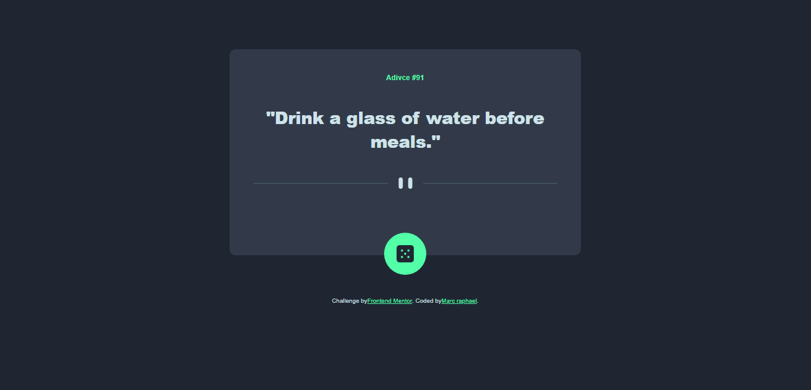

# Frontend Mentor - Advice generator app solution

This is a solution to the [Advice generator app challenge on Frontend Mentor](https://www.frontendmentor.io/challenges/advice-generator-app-QdUG-13db). Frontend Mentor challenges help you improve your coding skills by building realistic projects.

## Table of contents

- [Overview](#overview)
  - [The challenge](#the-challenge)
  - [Screenshot](#screenshot)
  - [Links](#links)
- [My process](#my-process)
  - [Built with](#built-with)
  - [What I learned](#what-i-learned)
  - [Useful resources](#useful-resources)
- [Author](#author)
- [Acknowledgments](#acknowledgments)

**Note: Delete this note and update the table of contents based on what sections you keep.**

## Overview

### The challenge

Users should be able to:

- View the optimal layout for the app depending on their device's screen size
- See hover states for all interactive elements on the page
- Generate a new piece of advice by clicking the dice icon

### Screenshot



**Note: Delete this note and the paragraphs above when you add your screenshot. If you prefer not to add a screenshot, feel free to remove this entire section.**

### Links

- Solution URL: [click here](https://www.frontendmentor.io/solutions/advice-generator-app-with-webpack-c6pFnthl1R)
- Live Site URL: [see live site here](https://advice-generator-marc-12.netlify.app)

## My process

### Built with

- Semantic HTML5 markup
- CSS custom properties
- Flexbox
- Mobile-first workflow
- [webpack](https://webpack.js.org/) - JS library
- [Advice slip JSON API](https://api.adviceslip.com/advice) - React framework

**Note: These are just examples. Delete this note and replace the list above with your own choices**

### What I learned

To day's challenge was a great was to learn how to work with JSON API to render datas, use fect(), async/await.

```html
<h1>Some HTML code I'm proud of</h1>
```
```js
// let's get our API url
let API_URL = 'https://api.adviceslip.com/advice';

// Now we fethc it to get a Json object
const get = async (url) => {
  const reponse = await fetch(url);
  return await reponse.json();
}

// Now we assign to an object the data we want
const API = {get}

// import our DOM elements
const quote = document.querySelector('.quote');
const id = document.querySelector('.id');

// Now, our function to get a random quote
const getRandomQuote = async () => {
  //we run the get() method in the API object wich is a JSON file
  API.get(API_URL).then(data => {
    // we assign the data to a variable
    const randomQuote = data.slip.advice;
    // we assign the id to a variable
    const randomId = data.slip.id;
    // we assign the quote to the DOM element
    quote.innerHTML = `"${randomQuote.toString()}"`;
    // we assign the id to the DOM element
    id.innerHTML = `Adivce #${randomId}`;
  })
}
```

### Useful resources

- [Medium article](https://medium.com/@ppt.co.uk/project-walk-through-building-a-simple-advice-slip-generator-cab99c62b8bb) - This helped me to understand the proces of fecthing data from a JSON API

## Author
- Frontend Mentor - [@Marcraphael12](https://www.frontendmentor.io/profile/Marcraphael12)
- GitHub - [@Marcraphael12](https://github.com/Marcraphael12)

## Acknowledgments

-Tej from HackClub - [@tej](https://hackclub.slack.com/team/U01PNGGBBT5)
